# Práctica 3: Filtro de Kalman Extendido (EKF) en ROS 2

Tercera Práctica impartida en la asignatura Ampliación de Robótica de 4º GIERM. 

En esta práctica se implementa un Filtro de Kalman Extendido (EKF) para estimar el estado de un robot móvil en movimiento, utilizando distintos modelos de movimiento y observación.

Entrega realizada por Patricio De Mariano Aguilera, DNI: 29555267Z

Todas las simulaciones se han realizado usando los rosbags proporcionados a un set rate de 2.0. Cada configuración (3d, 7d, 8d) se ha simulado en diferentes situaciones según el ruido (incertidumbre en la observación, incertidumbre en el modelo de movimiento)

Para cambiar las configuraciones de ruido, se deberá cambiar la variable "noise_config" por alguna de los siguientes valores:

- "base": ruido predeterminado por la práctica (equilibrado en general)
- "alto_obs": ruido más alto en las observaciones que en el modelo
- "alto_mod": ruido más alto en el modelo que en las observaciones

## Modelo 3D
### Caso base (valores por defecto)
#### Trayectoria circular
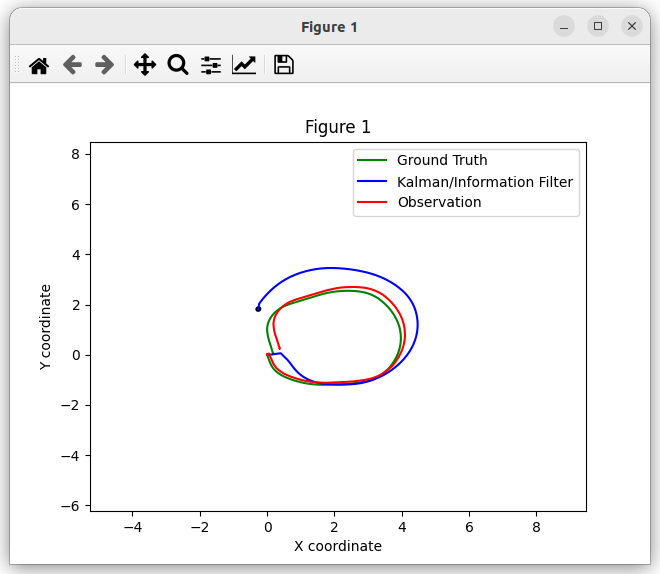

#### Trayectoria hexagonal
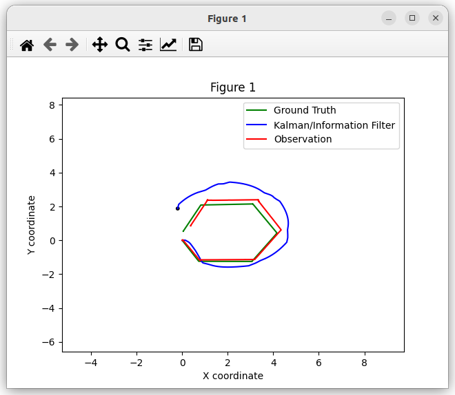

#### Trayectoria predeterminada
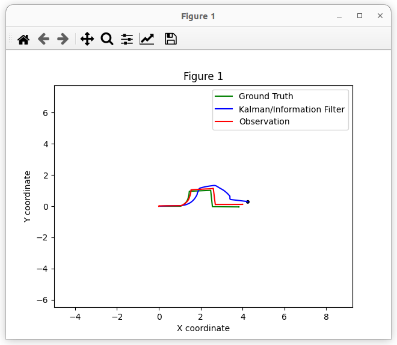

### Alta incertidumbre en la observación
#### Trayectoria circular
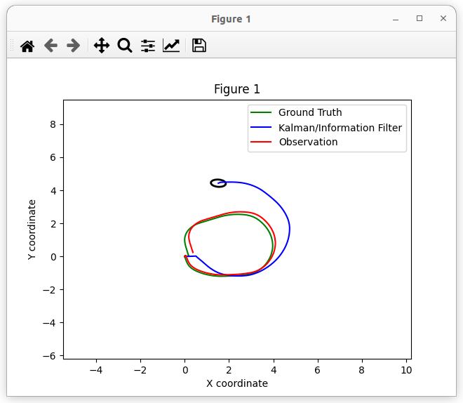

#### Trayectoria hexagonal
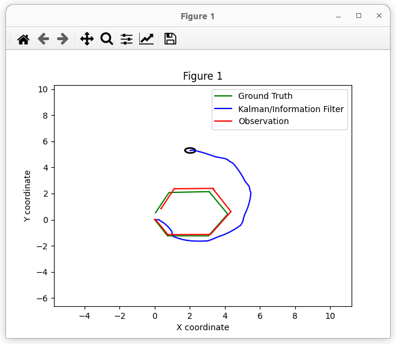

#### Trayectoria predeterminada
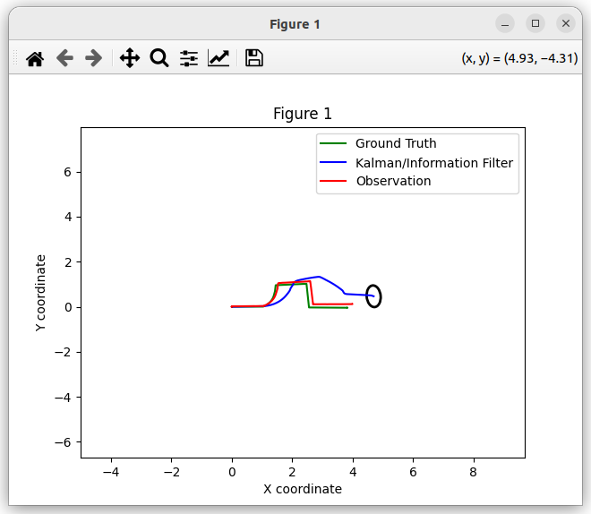

### Alta incertidumbre en el modelo de movimiento
#### Trayectoria circular
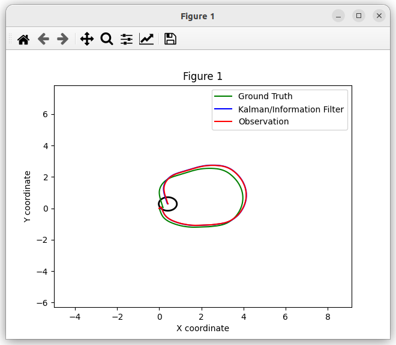

#### Trayectoria hexagonal
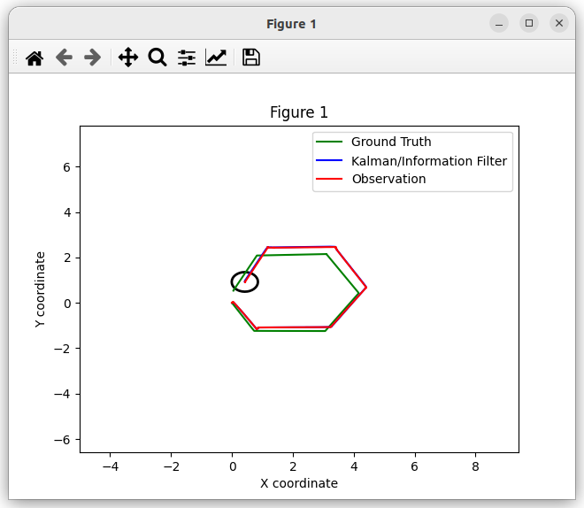

#### Trayectoria predeterminada
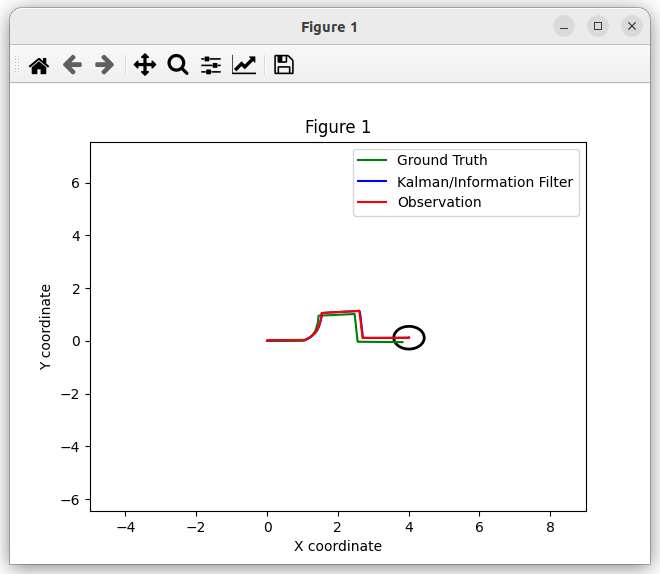

## Modelo 7D
### Caso base (valores por defecto)
#### Trayectoria circular
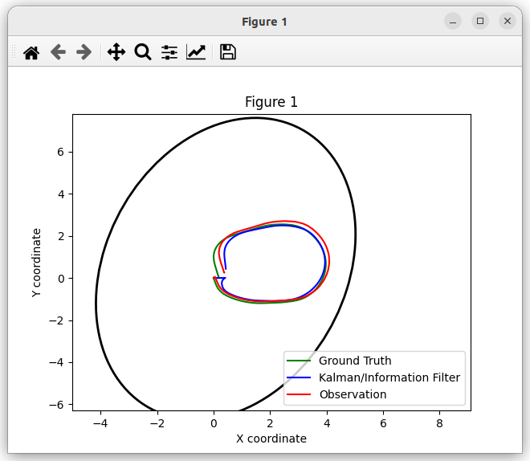

#### Trayectoria hexagonal
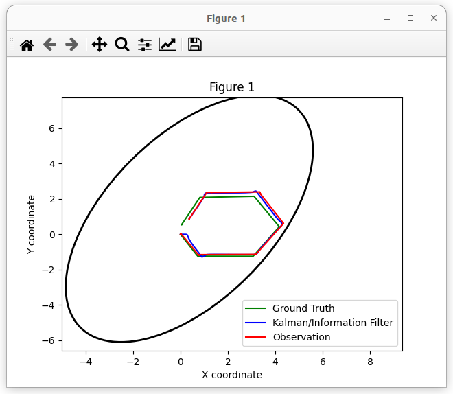

#### Trayectoria predeterminada
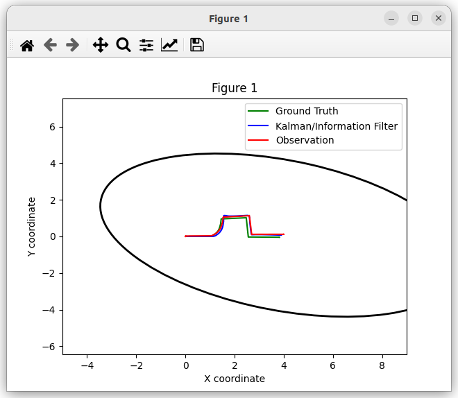

### Alta incertidumbre en la observación
#### Trayectoria circular
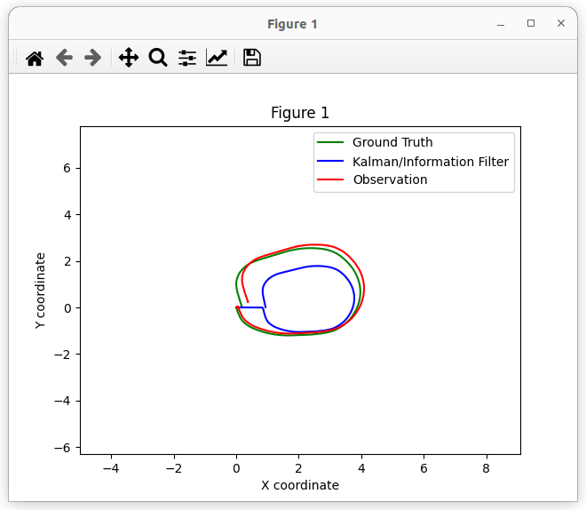

#### Trayectoria hexagonal
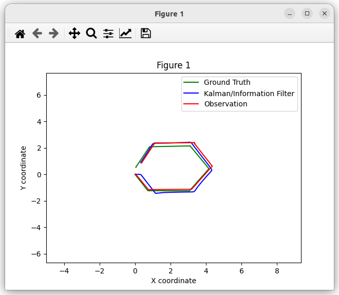

#### Trayectoria predeterminada
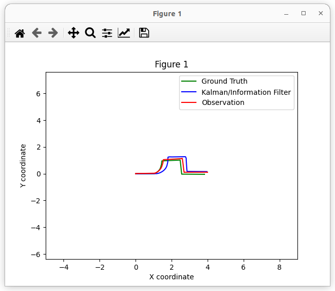

### Alta incertidumbre en el modelo de movimiento
#### Trayectoria circular
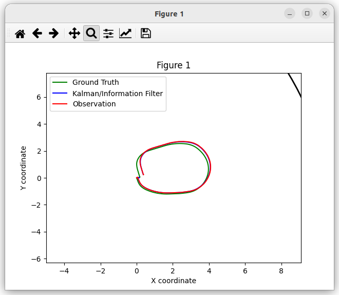

#### Trayectoria hexagonal
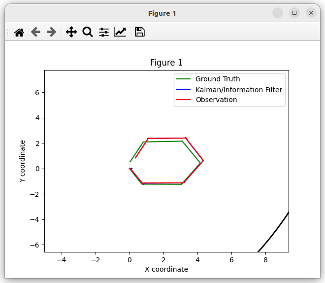

#### Trayectoria predeterminada
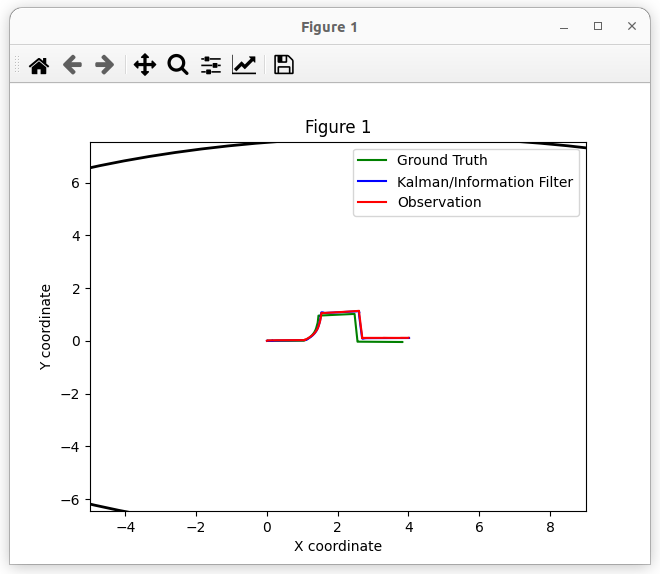

## Modelo 8D
### Caso base (valores por defecto)
#### Trayectoria circular
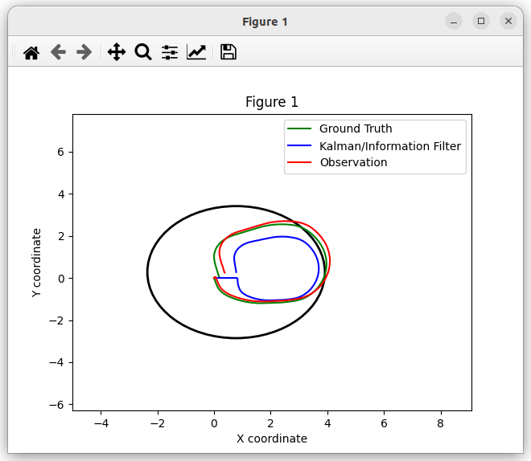

#### Trayectoria hexagonal
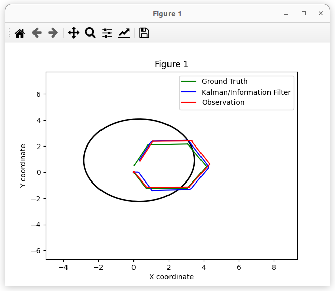

#### Trayectoria predeterminada
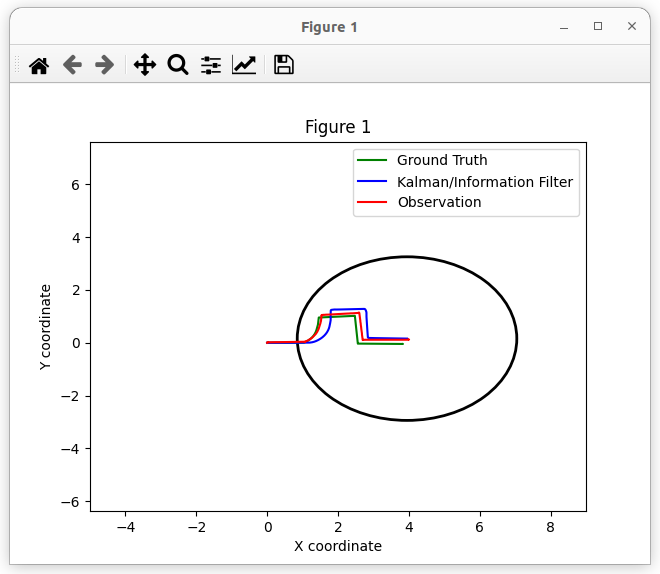

### Alta incertidumbre en la observación
#### Trayectoria circular
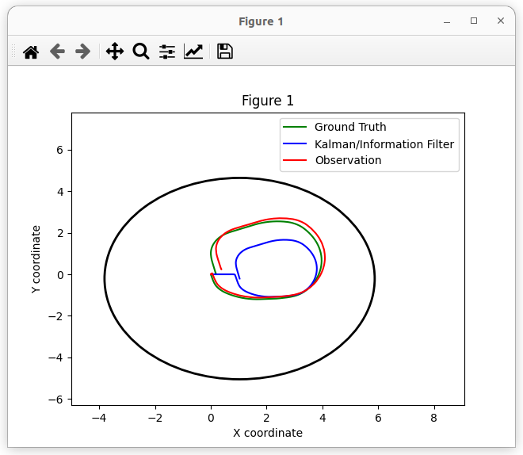

#### Trayectoria hexagonal
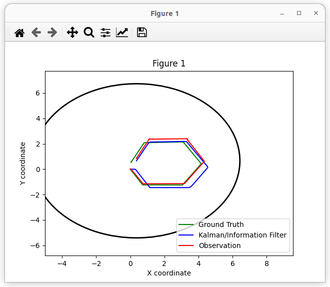

#### Trayectoria predeterminada
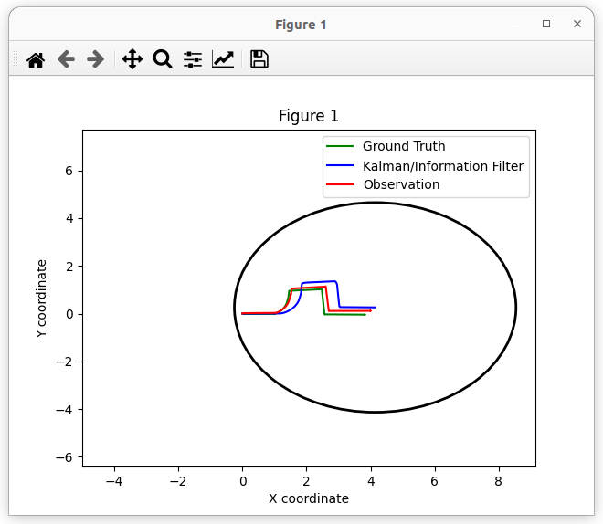

### Alta incertidumbre en el modelo de movimiento
#### Trayectoria circular
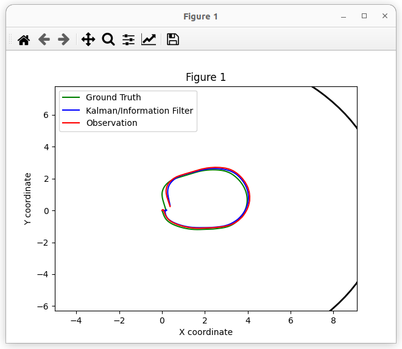

#### Trayectoria hexagonal
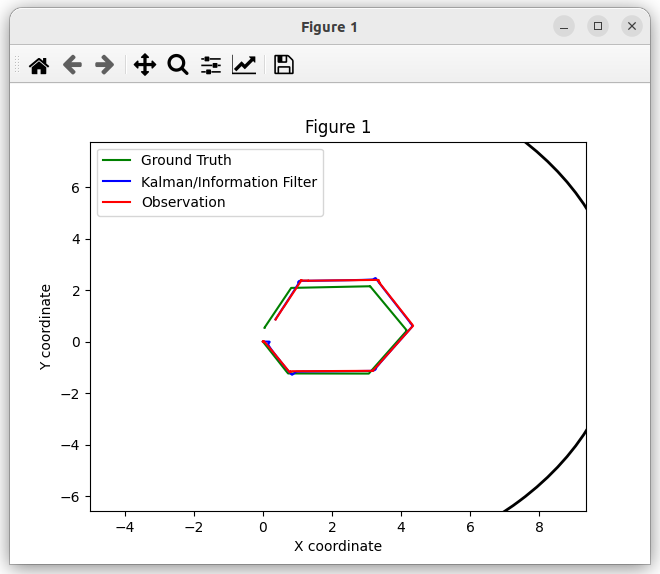

#### Trayectoria predeterminada
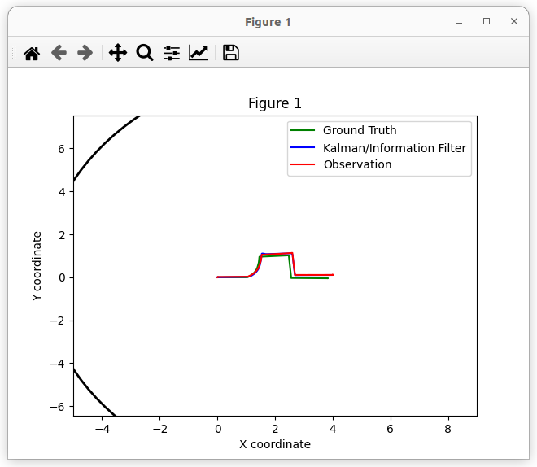

## Conclusión
### Diferencias entre modelos
**Modelo 3D:**

- Basado solo en odometría.
- Menor complejidad computacional.
- Precisión aceptable en trayectorias rectas, pero pierde fiabilidad en maniobras curvas o con orientación cambiante.

**Modelo 7D:**

- Fusiona odometría e IMU.
- Mejora en la estimación de orientación y velocidad angular.
- Aumenta la precisión en trayectorias dinámicas.

**Modelo 8D:**

- Considera velocidades cartesianas (vx, vy) y proporciona una mayor fidelidad en trayectorias curvas.
- Requiere mayor ajuste de parámetros y procesamiento.

### Resultados
Las diferencias entre modelos son evidentes en la suavidad de la trayectoria estimada, la capacidad de seguir curvas y la rapidez de convergencia a la posición real.
